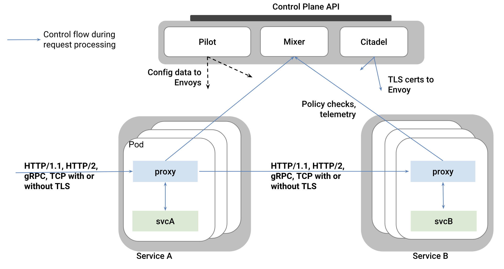
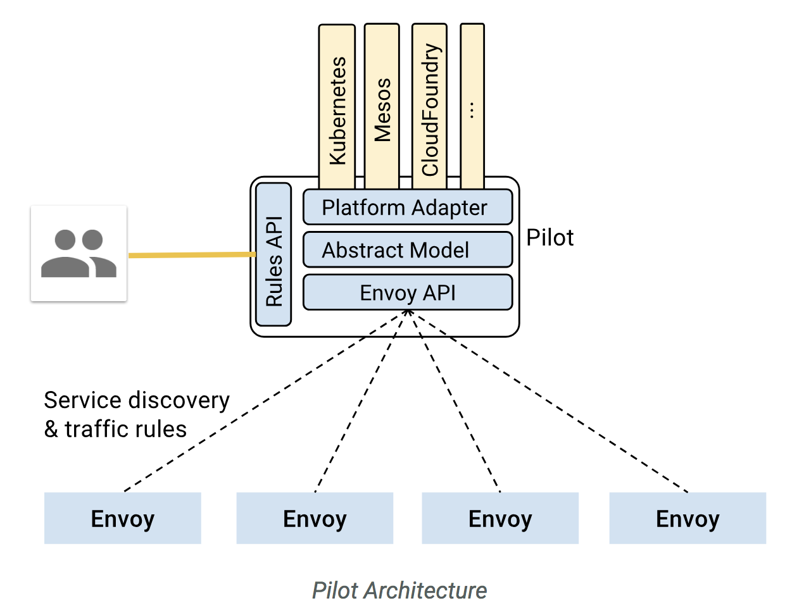
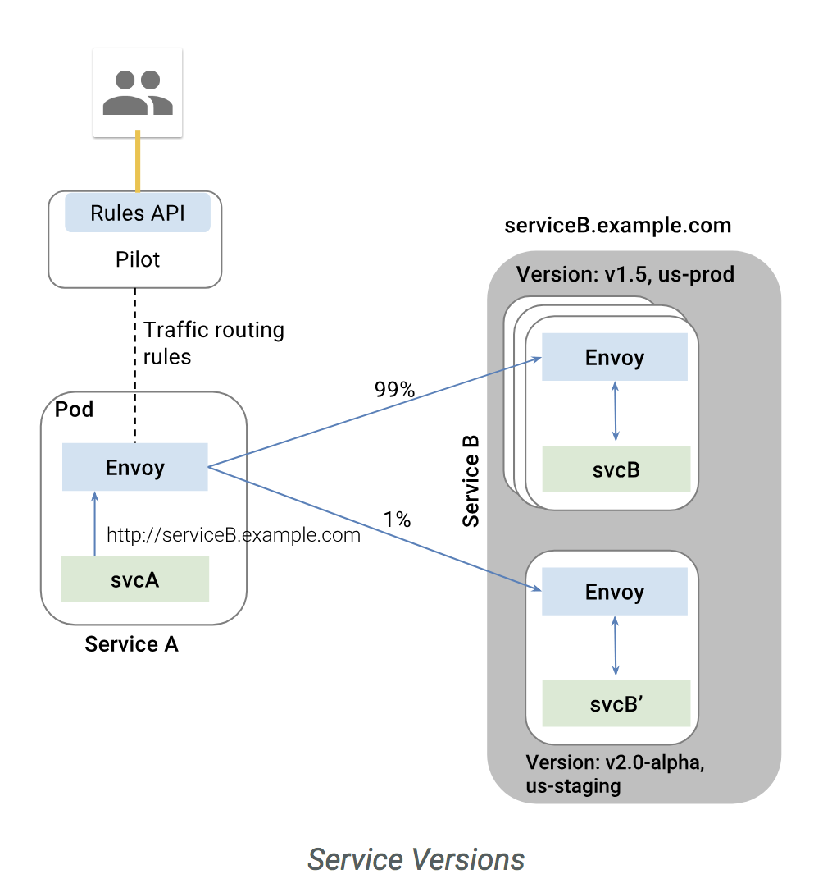
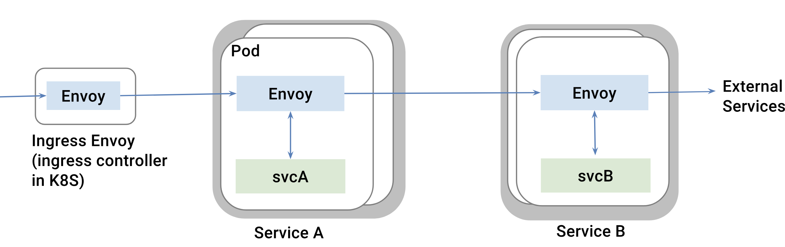
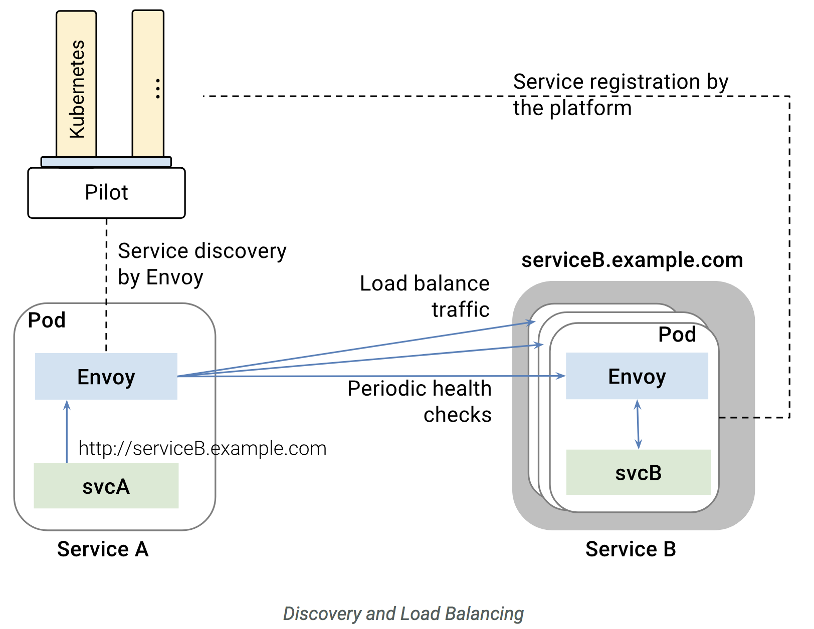

# Service Mesh
Microservice Architecture에서는 수 많은 서비스들의 인스턴가 동적으로 올라오고 사라집니다.  
또한 Monolitic Architecture에서 프로세스나 쓰레드와 같은 인스턴스 내부에서 처리하던 기능들이 MSA 환경에선 서비스 간 통신을 통해서 데이터를 처리합니다.   
이러한 복잡한 상황에서 **내부 네트워크를 안정적으로 유지** 하기 위해 Service Mesh라는 개념이 필요하게 되었습니다.  
Service Mesh는 Infrastructure Layer로 서비스 간 통신을 빠르고 신뢰할 수 있게 만들어 줍니다.     

Service Mesh 기능
- Service discovery
- Load Balancing
- Dynamic Request Routing
- Circuit Breaking
- Retry and timeout
- TLS
- Distributed Tracing
- Metrics   
...

## Service Mesh 구현 방법

### 1. 라이브러리 방식
Service Mesh의 초기 모델은 각 서비스마다 공통적으로 적용되는 라이브러리(Netflix OSS의 대부분)를 import 하는 방식이었습니다.  
하지만 라이브러리화는 서비스 간 통신에 대한 로직을 서비스 내부에서 관리하기 때문에 Application code와 종속성이 생기고 아래와 같은 이슈가 발생합니다.  
- 개발자가 비즈니스 로직에 집중하기 어렵게 만들고 통신 오류가 발생하였을 때 원인 파악이 어려움    
- 라이브러리 버전 변경이나 자체 버그로 인한 주요 서비스 영향  
- 라이브러리 언어에 종속되어 polyglot 구현이 어려움  

### 2. Sidecar Proxy 적용
  

Sidecar 패턴을 적용한 Service Mesh에서는 각 서비스에 Sidecar Proxy를 적용하여 마이크로서비스간 요청들이 해당 프록시를 통해 라우팅되도록 합니다.  
이때 Sidecar Proxy는 Application code 내부에 들어가는 것이 아니라 서비스와 분리되어 실행되기 때문에 비즈니스 로직과 내부 네트워크 관련 로직을 분리할 수 있습니다.  
이 경량화 Proxy에는 Routing rule, Circuit Breaker 등의 공통 기능을 적용하게 됩니다.   

Sidecar pattern을 적용하여 구현 된 Service Mesh Platform은 아래와 같습니다.  
- **Istio** by Google, IBM, Lyft
- **linkerd**, **conduit** by Buoyant

# Service Mesh platform - istio

Miscroservices들의 network를 관리하기 위한 platform  
Netflix OSS와는 다르게 **소스 코드 변경 없고, Java App이 아니더라도** 아래 기능에 대한 지원이 가능(Sidecar pattern)
- Service discovery
- Load balancing
- failure recovery
- rate limiting
- Service authentication
- Monitoring  

각 서비스에서 발생하는 모든 network traffic을  
envoy같은 sidecar proxy를 통해 istio가
수집하고 분석하여 service mesh를 지원  
현재 Kubernetes를 통한 사용이 가능하고, Eureka에 등록 된 서비스들도 지원 가능  

> Lyft's envoy 사용으로  
> Dynamic routing, service discovery, load balancing, TLS termination, gRPC 사용 가능  

## 1. Architecture
- Control plane  
  Proxy를 관리하고 Mixer롤 통해 서비스들의 telemetry를 관리    
- Data plane(proxy)  
  Sidecar pattern으로 서비스에 포함되며 App 서비스들간의 모든 통신 및 Control plane과의 통신을 제어

    

  #### Mixer
  Access control, usage policies를 proxy를 통해 적용하고 telemetry를 수집 함

  #### Pilot   
  sidecar proxy를 관리하고  
  아래 기능을 제공하기 위해 정의된 rule을 proxy로 배포  

  - Service discovery for envoys  
  - Dynamic routing table update
  - load balancing pool update
  - Resiliency(timeout, retires, circuit breakers)   

      

  #### Citadel  
  service간의 통신이나 end-user 사이에 자체 credential을 이용한 인증 기능을 제공 함

  #### Proxy(Envoy)
  서비스들의 모든 트래픽에 관여하여 service mesh 구성을 지원하기 위해 아래 기능을 제공  
  - service discovery  
  - load balancing  
  - TLS termination
  - HTTP/2 & gRPC proxying  
  - circuit breakers  
  - health checks
  - staged rollouts with %-based traffic split  
  - fault injection and rich metrics
  - monitoring metric 제공     
  - 자체 application instance pool 갖고 health check 수행  

## 2. 주요기능

### A. Traffic Management  
#### Communication between services
서비스 A는 envoy의 routing rule에 따라 서비스 B를 호출 함  
서비스 A는 다른 서비스에 대한 정보를 별도로 포함하거나 관리하지 않음  

  

#### Ingress and egress
내부 서비스 통신 외에 외부 서비스 API 호출도 envoy를 통해 할 수 있음  
이 경우 외부 API에도 Resiliency(timeout, retires, circuit breakers) 적용 가능  

  

#### Discovery and Load Balancing
Kubenetes같은 플랫폼을 통해 서비스가 등록되고,  
이를 Envoy가 discover하고 loadbalancing 하며 접근 함   

  

#### 기타
- Handling failure(by envoy)
  - timeouts
  - retires
  - 통시 접속 connections 수 제한
  - health check
  - circuit breakers
- Fault injection
  - 서비스를 죽이지 않고, 일부러 fault를 발생하여 다양한 테스트 가능  

### B. Security
App 서비스들을 고유하게 관리하고 서비스들 간의 통신을 보호  

TBD  

### C. Policies and Telemetry
서비스 정책 rule을 범용 적용 가능  
서비스들간의 의존도 및 상태를 모니터링 하기 위한 Metric 제공  

TBD  

## 3. Rule configuration
Virtual service에 Istio service mesh에서 서비스간에 어떻게 요청을 처리할지 정의 함  
[참고]https://istio.io/docs/concepts/traffic-management/rules-configuration/

TBD

출처 https://istio.io/

일정

금주 조사  ~ 7/27
2주후 까지 구현  7/30 ~ 8/17
1주후 DEP 구성을 위한 DEP 현황 공유 8/8일쯤

3 or 4주 후 부터 DEP POC 8/20 ~ 9/7

정리 및 보고 9/10 ~ 9/12
