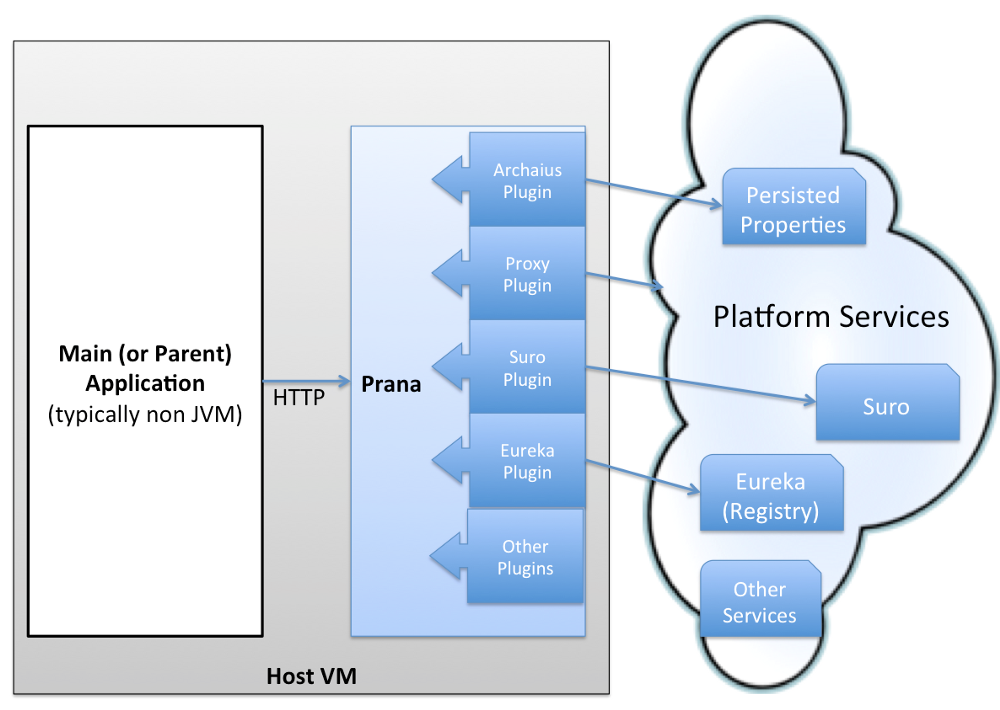

# 1. Sidecar Pattern

# Neflix Sidecar

### Prana
Netflix PaaS 생태계를 구성하는 라이브러리들의 대부분이 Java로 구현돼 있기 때문에 non-Java 서비스들을 위한 Polyglot  경을 위해 Netflix에서 Prana Sidecar를 사용합니다.

Prana 기능
- Eureka Registration
- Service discovery
- Dynamic Properties
- Proxy
- Healthcheck
- Admin UI

### Spring Cloud Netflix Sidecar
Netflix Prana로 부터 영향을 받은 Spring Cloud Netflix Sidecar는 non-JVM 서비스들이 Eureka, Ribbon, Config Server를 사용할 수 있도록 합니다.

Neflix Sidecar 기능
- service discovery : host:port/ 를 통하여 다른 방법에 비해 편하게 Non-JVM 어플리케이션에서 다른 Eureka 클라이언트를 찾을 수 있다.
- monitoring : health check uri 설정을 통해 Eureka서버에서 Non-JVM 어플리케이션의 동작 여부를 알수 있다.
- routing / proxying : Zuul을 통하여 Request를 받을 수 있다.
- balancing : 내장된 Ribbon을 통해 Client side load balancing 기능을 지원 한다.
- counfiguration : Spring Cloud Config를 통하여 configuration properties를 받을 수 있다.

# Service Mesh
Microservice Architecture에서는 수 십개의 MicroService로 분리되어 수 많은 인스턴스들이 동적으로 올라오고 사라집니다.
또한 Monolitic Architecture에서 프로세스나 쓰레드와 같은 인스턴스 내부에서 처리하던 기능들이 MSA 환경에선 서비스 간 통신을 통해서 데이터를 처리합니다.   
이러한 복잡한 상황에서 내부 네트워크를 안정적으로 유지하기 위해 Service Mesh라는 개념이 필요하게 되었습니다. Service Mesh는 Infrastructure Layer로 서비스 간 통신을 빠르고 신뢰할 수 있게 만들어 줍니다.     

Service Mesh 기능
- Service discovery
- Load Balancing
- Dynamic Request Routing
- Circuit Breaking
- Retry and timeout
- TLS
- Distributed Tracing
- Metrics   
...

### 라이브러리 적용
Service Mesh의 초기 모델은 각 서비스마다 공통적으로 적용되는 라이브러리를 import 하는 방식이었습니다. 하지만 라이브러리화는
서비스 간 통신에 대한 로직을 서비스 내부에서 관리하기 때문에 Application code와 종속성이 생깁니다. 따라서 개발자가 비즈니스 로직에 집중하기 어렵게 만들고 통신 오류가 발생하였을 때 원인을 파악하기 어렵게 만듭니다.  
또한 라이브러리를 가져다 쓰는 경우 주도권이 없기 때문에 버전 문제나 라이브러리가 제공하는 언어에 종속되기 때문에 MSA에서 완전한 Polyglot 환경을 구축하는데 어려움이 있습니다.

### Sidecar Proxy 적용
  

Sidecar 패턴을 적용한 Service Mesh에서는 각 서비스에 Sidecar Proxy를 적용하여 마이크로서비스간 요청들이 해당 프록시를 통해 라우팅되도록 합니다. 이때 Sidecar Proxy는 Application code 내부에 들어가는 것이 아니라 서비스와 분리되어 실행되기 때문에 비즈니스 로직과 내부 네트워크 관련 로직을 분리할 수 있습니다. 이 경량화 Proxy에는 Routing rule, Circuit Breaker 등의 공통 기능을 적용하게 됩니다.   

현재 활발히 진행되고 있는 Service Mesh Platform에는 Google, IBM, Lyft가 기여하고 있는 Istio, Buoyant에서 기여하고 있는 linkerd가 있습니다. 

# Service Mesh platform
## Istio

#### 주요기능
다음 기능을 통해 서비스를 플랫폼과 관리 정책등에서 분리하여
서비스 개발 및 운영을 유연하게 돕는다  
- Traffic Management  
  App 서비스들 간의 네트워크 흐름과 API 호출을 제어 함
- Service Identity and Security  
  App 서비스들을 고유하게 관리하고 서비스들 간의 통신을 보호
- Policy enforcement  
  서비스 정책을 범용 적용 가능  
- Telemetry  
  서비스들간의 의존도 및 상태를 모니터링 하기 위한 Metric

  #### 구성
  - Data plane(proxy)
    Sidecar pattern으로 서비스에 포함되며(Envoy) App 서비스들간의 통신 및 Control plane관의 통신을 제어
  - Control plane
    Proxy를 관리하고 Mixer롤 통해 서비스들의 telemetry를 관리  

    

  - Envoy
    서비스들의 모든 트레픽에 관여하여 service mesh 구성을 지원
    service discovery, load balancing, TLS termination, HTTP/2 & gRPC proxying, circuit breakers, health checks, staged rollouts with %-based traffic split, fault injection, and rich metrics 가능
    applicatin instance pool을 갖고 있어서 loadbalancing 지원 및 health check를 통한 instance 상태 최신화  
      - circuit breaker
        hystrix와는 다르게 envoy가 HTTP에러를 발생하고, 이를 호출한 app 서비스에서 fallback처리 해줘야 함

  - Mixer
    Access control, usage policies를 proxy를 통해 적용하고 telemetry를 수집 함

  - Pilot   
    Service discovery for envoys, dynamic routing resiliency(timeout, retires, circuit breakers) 기능 지원   
      
      

  - Citadel  
    자체 credential을 이용한 인증 기능

    #### Rule configuration
    Virtual service에 Istio service mesh에서 서비스간에 어떻게 요청을 처리할지 정의 함
    [참고]https://istio.io/docs/concepts/traffic-management/rules-configuration/

## Linkerd

일정

금주 조사  ~ 7/27
2주후 까지 구현  7/30 ~ 8/17
1주후 DEP 구성을 위한 DEP 현황 공유 8/8일쯤

3 or 4주 후 부터 DEP POC 8/20 ~ 9/7

정리 및 보고 9/10 ~ 9/12

버퍼 17
