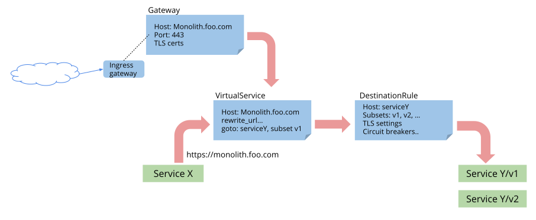

# Istio Gateway
Istio는 트래픽 관리를 위해 RouteRule, DestinationPolicy,EgressRule,Ingress(Kubernetes)를 사용하는 API를 지원합니다.   
API를 통해서 특정 버전의 서비스로 라우팅하거나, delay 설정, failures, timeout, circuit breakers.. 등의 설정을 코드 변경없이 적용할 수 있습니다.


하나 이상의 로드밸런서를 가진 (Ingress)Gateway mesh는 외부 트래픽을 받아 sidecar gateway로 전달하여 내부 서비스로 접근합니다. 외부 서비스에 접속하기 위해선 sidecar gateway에서 egress gateway를 통해 직접 접근합니다.

v1alpha3 버전에서는 트래픽 라우팅 관리를 위해 다음 4개의 설정을 사용합니다.
1. Geateway
2. VirtualService
3. DestinationRule
4. ServiceEntry



### Gateway
Gateway는 HTTP/TCP 트래픽에 대한 로드밸런싱 설정을 합니다.  
Gateway는 다른 설정으로 여러 개 둘 수 있고 pod label을 명시해서 특정 작업에만 바운딩 되게 할 수 있습니다.
트래픽 관리에 왜 Kubernetess Ingress APIs를 사용하지 않는지 궁금증이 생길 수 있는데요.  
Ingress API는 Istio가 원하는 라우팅 요구사항을 다 충족하지 않습니다.   
예를들면, Ingress는 대부분 기본적인 HTTP 라우팅만 가능하고 다른 프록시 설정들은 사용하기 불편한 어노테이션 기반으로 작성해야 합니다.

Istio Gateway는 L4-L6 스펙을 L7으로부터 분리해서 Ingress의 단점을 극복했습니다.  
사용자들은 Gateway로 들어오는 트래픽을 VirtualService에 바인딩하여  
HTTP 뿐만 아니라 TCP 트래픽 설정을 표준화된 Istio rule로 설정할 수 있습니다.

eg) bookinfo.com 호스트에 대한 외부 https 트래픽을 받는 Gateway 로드밸런싱 설정입니다.     
```yml
apiVersion: networking.istio.io/v1alpha3
kind: Gateway
metadata:
  name: bookinfo-gateway
spec:
  servers:
  - port:
      number: 443
      name: https
      protocol: HTTPS
    hosts:
    - bookinfo.com
    tls:
      mode: SIMPLE
      serverCertificate: /tmp/tls.crt
      privateKey: /tmp/tls.key
```
라우팅 설정을 위해 동일한 호스트로 정의된 VirtualService를 만들고 gateways 필드에 위에서 만든 Gateway를 바우딩해줍니다.
```yml
apiVersion: networking.istio.io/v1alpha3
kind: VirtualService
metadata:
  name: bookinfo
spec:
  hosts:
    - bookinfo.com
  gateways:
  - bookinfo-gateway # <---- bind to gateway
  http:
  - match:
    - uri:
        prefix: /reviews
    route:
    ...
```

### VirtualService
Gateway에 대한 라우팅 설정을 VirtualService에 해줍니다.
동일한 호스트 정보로 VirtualService를 Gateway에 바운딩하여 해당 호스트를 외부로 노출시켜 줍니다.  
각각의 서비스 버전은 service subset 이름을 가지는데 해당 정보는 DestinationRule에 설정합니다.  
```yml
apiVersion: networking.istio.io/v1alpha3
kind: VirtualService
metadata:
  name: bookinfo
spec:
  hosts:
    - bookinfo.com
  http:
  - match:
    - uri:
        prefix: /reviews
    route:
    - destination:
        host: reviews
        subset: v1
  - match:
    - uri:
        prefix: /ratings
    route:
    - destination:
        host: ratings
        subset: v2
  ...
```

### DestinationRule
DestinationRule에는 트래픽을 어떤 서비스로 전달할 것인지에 대한 정책을 설정해줍니다.  
서비스를 관리하는 사람이 circuit breakers, load balancer, TLS 설정 등을 명시해줍니다.  
subset을 지정해 주면 VirtualService에서 해당 정보를 가지고 라우팅 정보를 설정합니다.  
```yml
apiVersion: networking.istio.io/v1alpha3
kind: DestinationRule
metadata:
  name: reviews
spec:
  host: reviews
  trafficPolicy:
    loadBalancer:
      simple: RANDOM
  subsets:
  - name: v1
    labels:
      version: v1
  - name: v2
    labels:
      version: v2
    trafficPolicy:
      loadBalancer:
        simple: ROUND_ROBIN
  - name: v3
    labels:
      version: v3
```

### ServiceEntry
외부 서비스에 접속하기 위해선 아래와 같이 ServiceEntry를 만들고 접속할 서비스에 대한 설정을 합니다.
```yml
cat <<EOF | istioctl create -f -
apiVersion: networking.istio.io/v1alpha3
kind: ServiceEntry
metadata:
  name: google-ext
spec:
  hosts:
  - www.google.com
  ports:
  - number: 443
    name: https
    protocol: HTTPS
EOF
```

ServiceEntry에 대한 VirtualService를 만들어 라우팅 설정을 할 수 있습니다.
```yml
cat <<EOF | istioctl create -f -
apiVersion: networking.istio.io/v1alpha3
kind: VirtualService
metadata:
  name: google-ext
spec:
  hosts:
    - www.google.com
  http:
  - timeout: 3s
    route:
      - destination:
          host: www.google.com
        weight: 100
EOF
```

참고 https://istio.io/blog/2018/v1alpha3-routing/
